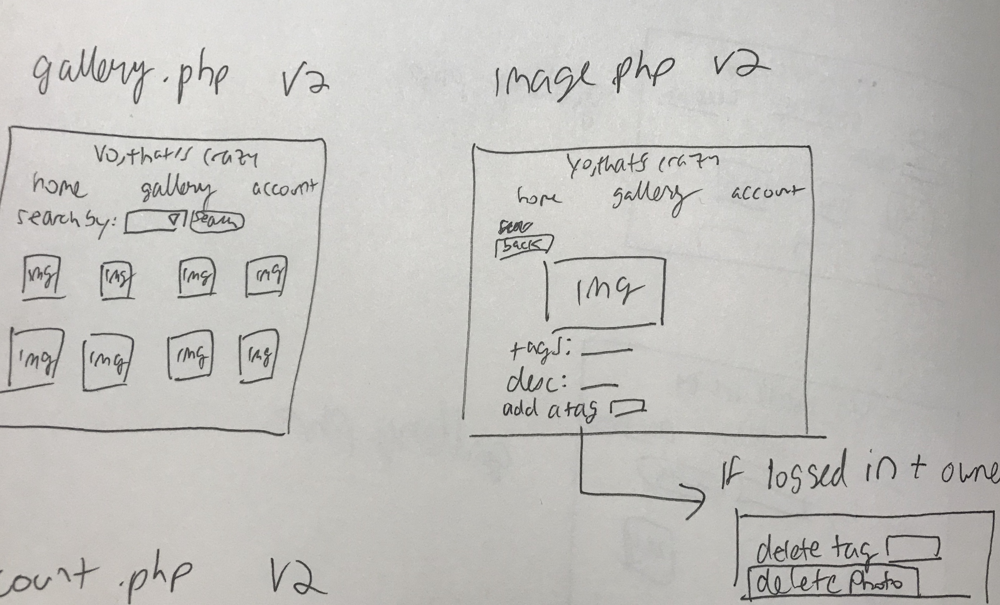

# Project 3: Design Journey

Your Name: Annie Fu

**All images must be visible in Markdown Preview. No credit will be provided for images in your repository that are not properly linked in Markdown. Assume all file paths are case sensitive!**


# Project 3, Milestone 1 - Design, Plan, & Draft Website

## Describe your Gallery

The gallery is a collection of eclectic images taken and uploaded by Cornell students in their everyday lives on campus.


## Target Audiences

One - Current Cornell undergraduate students who want to share cool photos their peers take on the daily.
Two - Cornell faculty and staff who want to view/ know about some random occurrences on Cornell campus, and learn more about current everyday student life.


## Design Process

[Document your design process. Show us the evolution of your design from your first idea (sketch) to design you wish to implement (sketch). Show us the process you used to organize content and plan the navigation (e.g. card sorting).]

[Label all images. All labels must be visible in Markdown Preview.]


Initial Brainstorm Journey for navigation/homepage


Initial Brainstorm Journey for Gallery Page


Decisions made after my initial brainstorming session:
- decided to simplify the entire design. The idea is straightforward, and one of my target audiences is mostly familiar with social media/technology, while the other one is probably best off with a cleaner, simpler design.

- cut down navigation to 3 links - home, gallery, account

First Homepage sketch


First Gallery Page Sketch


## Final Design Plan

Decisions made for final iteration:

- addition of viewing user images on account page - better UX
- cleaner gallery page - no tags or description on gallery page
- addition of separate image page for viewing single image

Final Index Design

Final Gallery + Single Image Design

Final My Account Design


## Templates

Gallery: The code for the gallery, which contains both the search/filter feature as well as the initial fully displayed image set.

Header: contains the main banner and the nav links.

Login: The form template I insert wherever I want the user to be able to login.

Signout: PHP Template that checks if a user is logged in, and if so, displays as a log out link.

## Database Schema Design

[Describe the structure of your database. You may use words or a picture. A bulleted list is probably the simplest way to do this. Make sure you include constraints for each field.]


[Hint: You probably need `users`, `images`, `tags`, and `image_tags` tables.]

[Hint: For foreign keys, use the singular name of the table + _id. For example: 1) `user_id` in the `images` table or 2) `image_id` and `tag_id` for the `image_tags` table.]


```
users (
id : INTEGER {PK, U, Not, AI} -- primary key
username: Text {U, Not}
password: Text {Not}
)

images (
id : INTEGER {PK, U, Not, AI} -- primary key
file_name : Text {U, Not}
file_ext: Text { Not}
user_id: INTEGER {PK, U, Not, AI] - foreign key
description: Text
)

tags (
id : INTEGER {PK, U, Not, AI} -- primary key
tag_name : {Text, U, Not}
)

This is the table that joins together the image/tag association for the search feature and for displaying tags under an image.

image_tags (
id : INTEGER {PK, U, Not, AI} -- primary key
image_id: INTEGER {PK, U, Not, AI} - foreign key
tag_id: INTEGER {PK, U, Not, AI} - foreign key
)

```

## Code Planning

[Plan what top level PHP pages you'll need.]
Index.php - the homepage, gives a brief intro / background of the site
gallery.php  - contains the images and the filtering feature
account.php - page where user signs in and manages their account, view their uploads or adds new ones.
Image.php - opens when the user selects an image to view the details

[Plan what templates you'll need.]
Header: header image + nav list
Footer: Footer paragraph
Login template: contains the login form
gallery - will show the images from the images table

[Plan any PHP code you'll need.]
```
//Photo gallery

Search:
-Get input for the tag they want
- Filter
- SQL query searches the images_tags table
- Output the records that match user input


// User Controls
function is_user_logged_in() {
  if user is logged in - true
  otherwise, false
}

deleting the user's images:
SELECT images that match the current_user's id , which we palce into a variable wen the user logs in. if they match, display the images that match.

If they click delete,:
DELETE image_id from images table, and DELETE corresonding info in image_tags table as well.


//SECURITY

when logging in:
filter input, escape output


when uploading image:
filter description and escape the output when displaying.


```

## Database Query Plan

Need:

Insert password into table when logging in

Insert Uploaded Image information (file_name, file_ext, description) into images

Insert tag/image association into image_tags

Select all images of a certain tag through the filter feature

Select all images from images table to display full gallery

Delete image from both images table and image_tags table if the image user id is the logged in user

Delete tags

Insert tags


# Project 3, Milestone 2 - Gallery and User Access Controls

## Issues & Challenges
This was insanely complicated and I got really confused keeping track of variables in different tables, and how all the files were interacting.

I have a lot of debugging to do, and a lot of stuff doesn't work

sigh


### Reflecting again upon Final Submission
The inital task of using JOINS and queries to show selected images was intimidating, but I learned how to use external resources well, especially reference documentation.


# Final Submission: Complete & Polished Website

## Reflection


When starting this assignment, I had a surface level understanding of associating php templates and pages with html structures. Since so many different elements from the database, css, HTML, and PHP templates interact in this project, I gained a lot of experience in keeping code organized and going systematically.

In other words, I learned a lot about planning and excuted multi-faceted coding projects.
I'm really happy to share this site with my friends!
